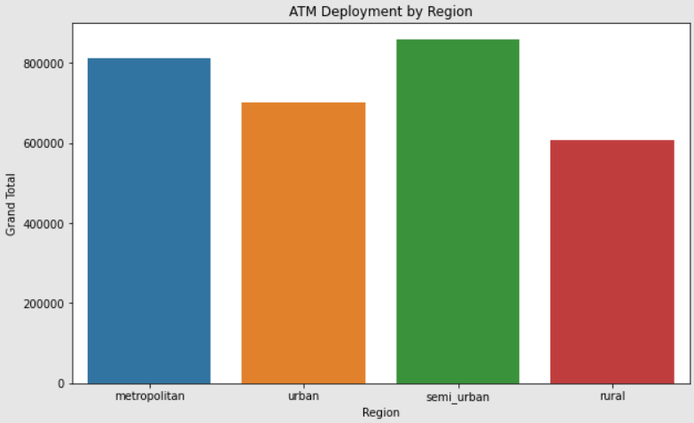
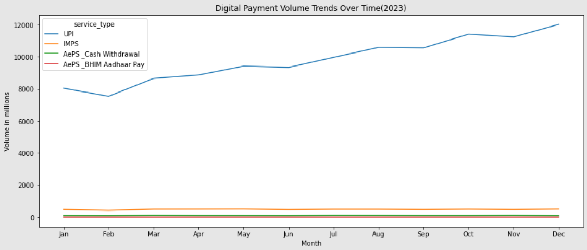
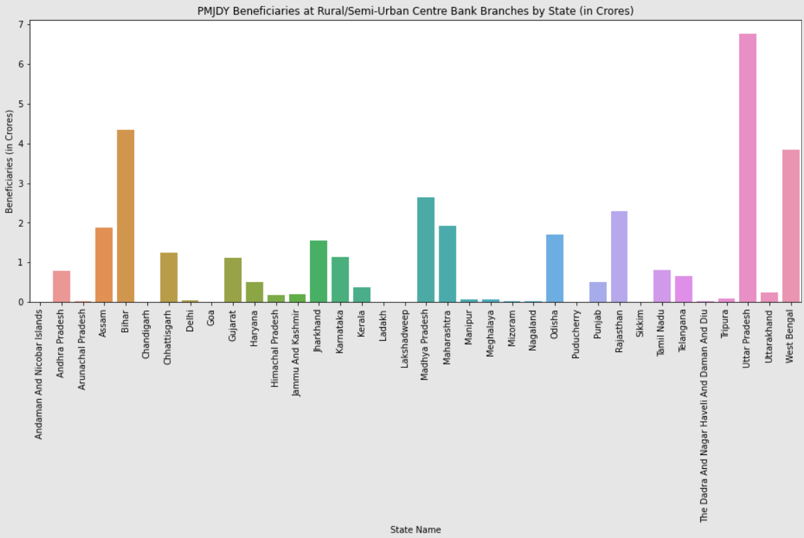
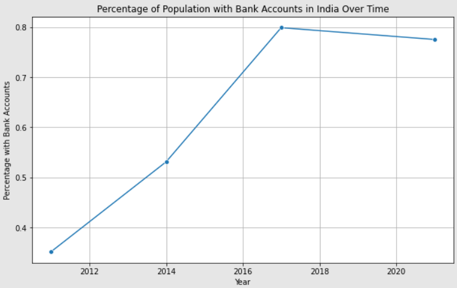

# Digital Payment Trends and Financial Inclusion in Rural India

## Introduction

This project aims to analyze the trends in digital payments and assess the state of financial inclusion in rural India. Using various datasets, including ATM deployment data, digital payment transaction data, PMJDY beneficiary data and Global Findex Database,  seek to uncover patterns, correlations, and actionable insights to improve financial inclusion.

## Objectives

1. **Analyze Trends in Digital Payments:**
   - Understand trends in UPI, IMPS, AEPS (BHIM Aadhaar Pay), and AEPS (Cash Withdrawal) during different months in 2023.
   - Compare digital payment trends with ATM deployment data.

2. **Financial Inclusion Analysis:**
   - Assess financial inclusion levels using the PMJDY dataset.
   - Correlate digital payment adoption with financial inclusion indicators.

3. **Regional Analysis:**
   - Examine how regional and demographic factors influence financial inclusion.

4. **Comparative Analysis with Global Data:**
   - Use the Global Findex Database to compare financial inclusion levels in India over the years and against global trends.

## Data Collection

1. **ATM Deployment Data:** Quarterly data for 2023 on bank-wise and region-wise deployment of ATMs, CRMs, and WLAs.
2. **Digital Payment Data:** Monthly transaction data for UPI, IMPS, AEPS (BHIM Aadhaar Pay), and AEPS (Cash Withdrawal).
3. **PMJDY Data:** Data on beneficiaries at rural/semi-urban and urban/metro center bank branches.
4. **Global Findex Database:** Headline findings from the 2021 survey on account ownership.

## Exploratory Data Analysis

1. **ATM Deployment by Region:**

2. **Digital Payment Trends in 2023:**

3. **PMJDY Beneficiaries at Rural/Semi-Urban:**

4. **Percentage of Population with Bank Accounts in India Over Time:**

## Insights and Conclusions

1. **ATM Deployment:**
   - The majority of ATMs are concentrated in metropolitan and urban areas, indicating a potential gap in access for rural regions.

2. **Digital Payment Trends:**
   - UPI shows a consistent upward trend, reflecting its growing adoption and popularity.
   - Seasonal variations and spikes in digital payment volumes can be observed, possibly linked to festivals, holidays, or government initiatives.
  
3. **Comparative Analysis:**
   - India has made substantial progress in financial inclusion compared to previous years, as shown by the Global Findex Database.
   - However, there is still room for improvement to match global standards, particularly in rural areas.

